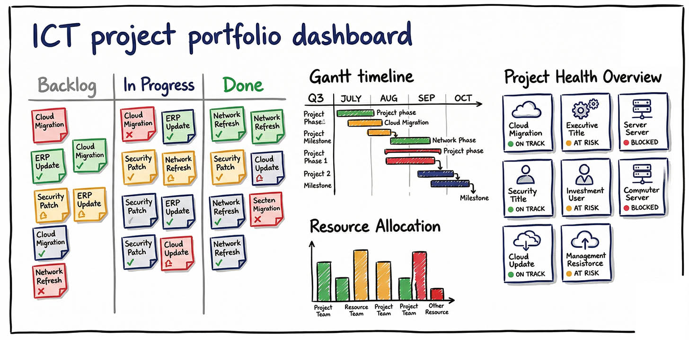
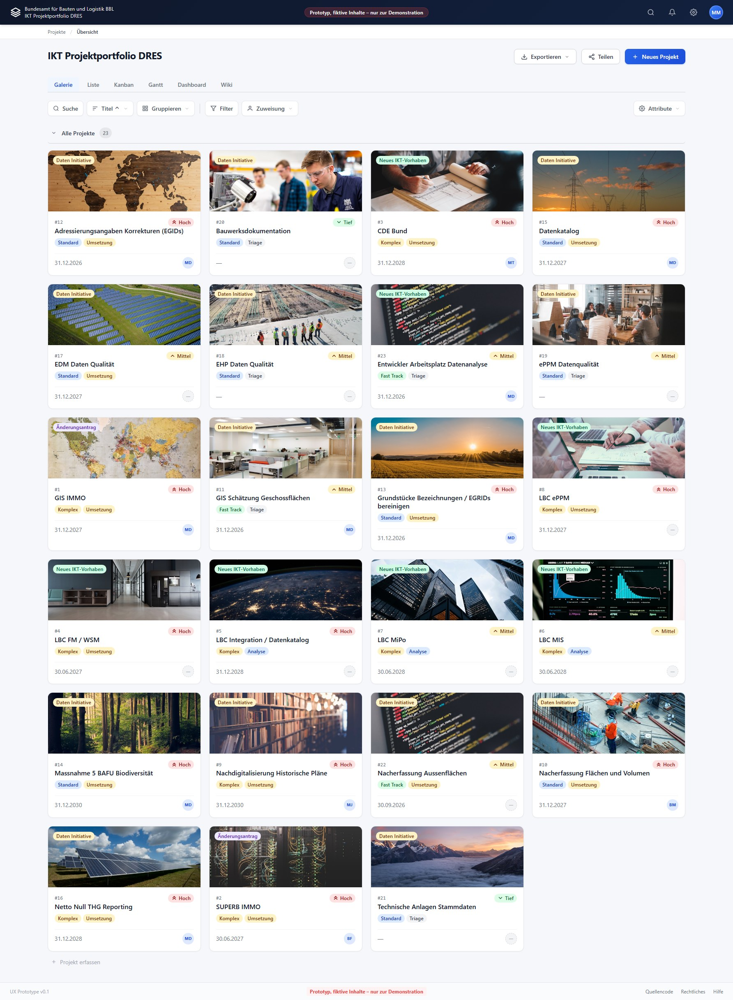
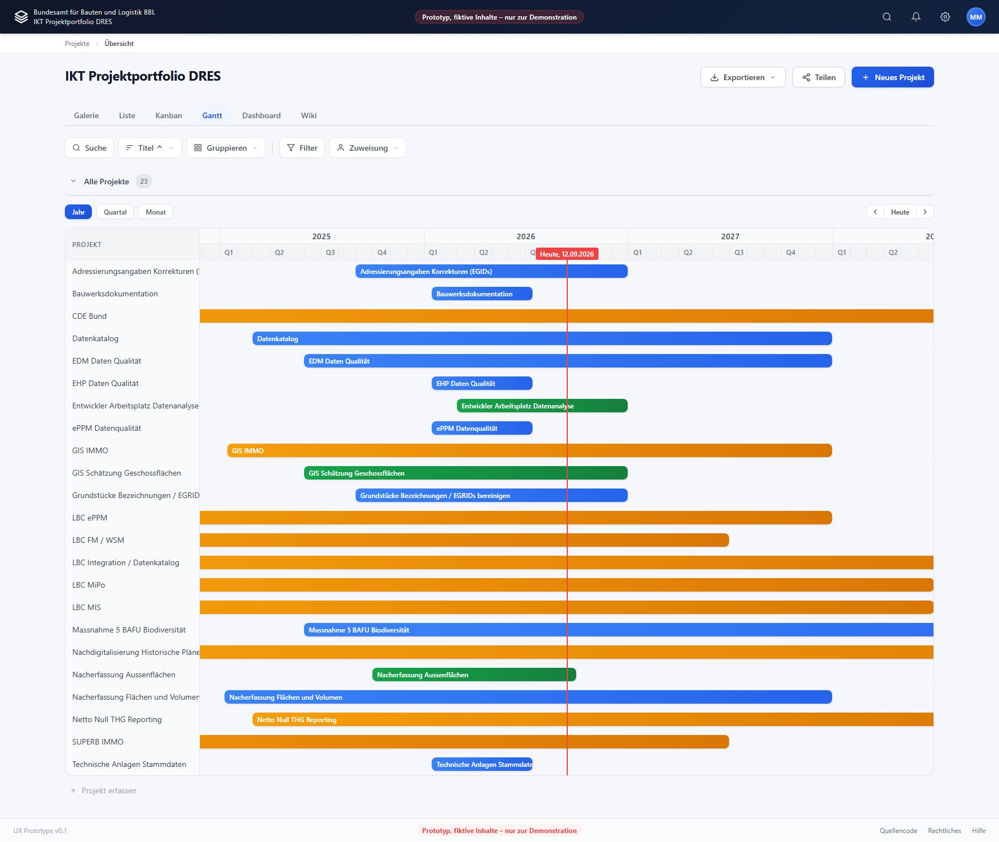

# IKT Projektportfolio DRES

<p align="center">
  <a href="https://bbl-dres.github.io/ict-portfolio/">
    
  </a>
</p>

[](https://bbl-dres.github.io/ict-portfolio/)
[](LICENSE)

> [!CAUTION]
> Unofficial prototype for demonstration only. The data is fictional and not every feature is fully functional.

Static portfolio-management prototype for the ICT division at DRES (Bundesamt für Bauten und Logistik BBL).

## Demo

**Live demo:** https://bbl-dres.github.io/ict-portfolio/

<p align="center">
  
  
</p>

## Features

- Gallery, list, and kanban views for ICT projects.
- Filtering, sorting, grouping, and click-to-filter tags.
- Shareable URLs that preserve the current view and filters.
- Project details with comments and change history.
- CSV and PDF exports.

## Run locally

```bash
python -m http.server 8000
```

Open <http://localhost:8000/>.

## Documentation

- [Data model](docs/DATAMODEL.md)
- [Requirements](docs/REQUIREMENTS.md)
- [Wireframes](docs/WIREFRAME.md)

## License

[MIT License](LICENSE).
